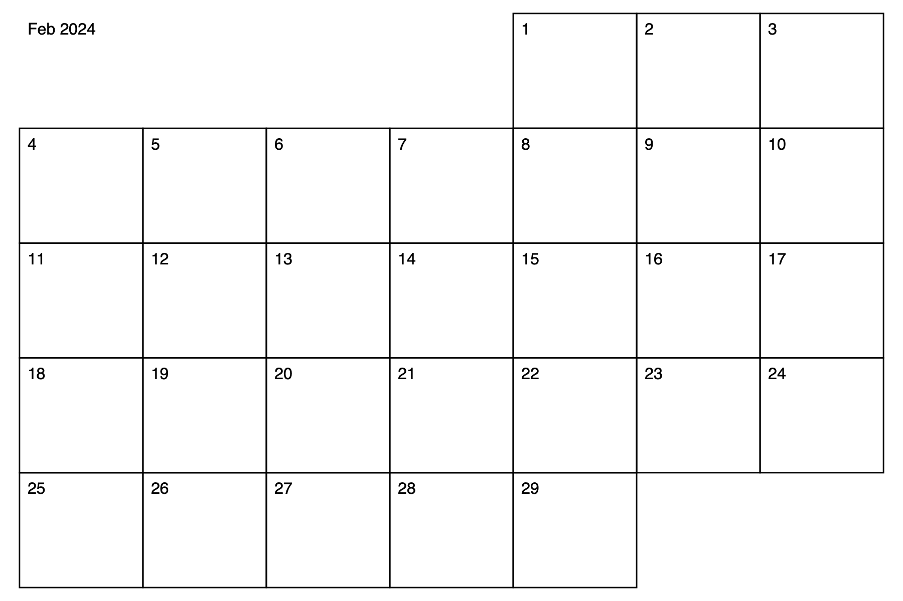

# Generate a printable calendar in PDF format.

## Usage

```
» python pycalendar.py
```



```
» python pycalendar.py --help
Usage: pycalendar.py [OPTIONS]

Options:
  --year INTEGER                  [default: 2024]
  --month INTEGER                 [default: 2]
  --file PATH                     [default: calendar.pdf]
  --size [letter|legal|label_4x6|label_4x8]
                                  [default: letter]
  --landscape / --no-landscape    [default: landscape]
  --ordinals / --no-ordinals      [default: no-ordinals]
  --label / --no-label            [default: label]
  --help                          Show this message and exit.
```

## Installation

1. [Install Poetry](https://python-poetry.org/docs/#installation) (with pipx recommended)
1. Clone this repo
1. `poetry install`
1. `python pycalendar.py`

## History (copied from fork)

Tested with Python 3.11.

Originally created by Bill Mill on 11/16/05, this script is in the public
domain. There are no express warranties, so if you mess stuff up with this
script, it's not my fault.

Refactored and improved 2017-11-23 by Stephan Sokolow (http://ssokolow.com/) in https://gist.github.com/ssokolow/7eace74070778abe637bcd56b105e0d4.

Updated 2024-02-08 by Gabe Joseph to:
- support Python 3
- add a CLI
- add a year and month label
- manage dependencies with Poetry for easy installation